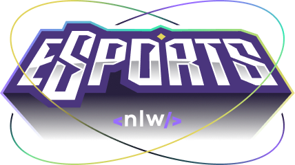

<p align="center">

</p>

<div align="center">
   </br>
   <a href="#-technologies-used">
      
      
      
      
      
      
      
      
   </a>
</div>

## 📃 About

**NLW eSports** is a project developed from the ground up during the Ignite trail of **Next Level Week**, an online event produced by [**Rocketseat**](https://github.com/Rocketseat).
</br>
</br>
The project is an app that allows users to post an ad to find other players in the game they want.

## ✨ Features

- [x] List of games (web and mobile)
- [x] Creation of a new ad (web)
- [x] User feedback: loading during creation, success and error (web)
- [x] Ad listing (mobile)
- [x] Receiving push notifications (mobile)
- [x] Copy discord user to clipboard (mobile)

## 🚀 Technologies and tools used

<table>
   <tbody>
      <tr>
         <td style="font-weight: bold">Front-end on web</td>
         <td>
         <a href="https://reactjs.org/" target="_blank" rel="noopener noreferrer">React</a>,
         <a href="https://www.typescriptlang.org/" target="_blank" rel="noopener noreferrer">TypeScript</a>,
         <a href="https://vitejs.dev/" target="_blank" rel="noopener noreferrer">Vite</a>,
         <a href="https://www.radix-ui.com/" target="_blank" rel="noopener noreferrer">RadixUI</a>,
         <a href="https://formik.org/" target="_blank" rel="noopener noreferrer" >Formik</a>,
         <a href="https://tailwindcss.com/" target="_blank" rel="noopener noreferrer">TailwindCSS</a> and 
         <a href="https://phosphoricons.com/" target="_blank" rel="noopener noreferrer" >Phosphor Icons</a> 
         </td>
      </tr>
      <tr>
         <td style="font-weight: bold">Front-end on mobile</td>
         <td>
          <a href="https://reactnative.dev/" target="_blank" rel="noopener noreferrer">React Native</a>
          and
          <a href="https://expo.dev/" target="_blank" rel="noopener noreferrer">Expo</a>
         </td>
      </tr>
      <tr>
         <td style="font-weight: bold">Back-end (web/mobile)</td>
         <td>
          <a href="https://nodejs.org/en/" target="_blank" rel="noopener noreferrer">NodeJs</a>
          and
          <a href="https://www.prisma.io/" target="_blank" rel="noopener noreferrer">Prisma</a>
         </td>
      </tr>
   </tbody>
</table>

## 🔧 Install and run

To download the source code of the project to your machine, you will first need to have [**GIT**](https://git-scm.com/) installed.

With GIT installed, in your terminal run the following command:

```bash
git clone https://github.com/tanjounokamioku/nlw-esports.git
```

To install the dependencies and run the project you will need to have [**Node.js**](https://nodejs.org/en/) installed on your machine, which comes with NPM.

Navigate to separate subfolders for each project (web/mobile/server) and run the following command:

```bash
npm install
```

Run the web project:

```bash
npm run dev

```

Run node server:

```bash
npm run dev

```

Run the mobile project:

```bash
npm start

```

Open the project on mobile:

```bash
expo start

```

Open Prisma visual on web:

```bash
npx prisma studio

```

<h5 align="center">
  &copy;2023 - <a href="https://github.com/tanjounokamioku/">Tanjou</a>
</h5>
